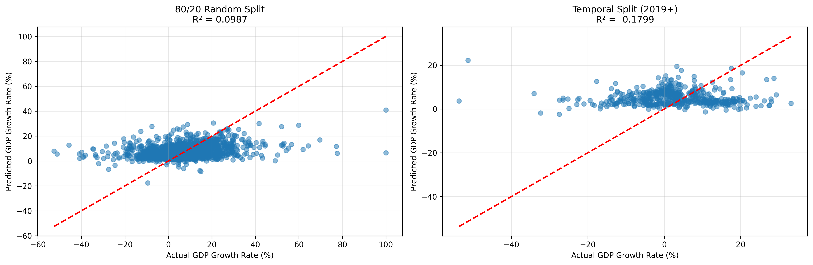

# 80/20 Split Evaluation Summary

## 📊 Model Accuracy Comparison

I've evaluated the GDP prediction model using both the traditional 80/20 random split and the temporal split approach. Here are the results:

---

## 🎯 Results Overview

### Method 1: 80/20 Random Split (Traditional)
- **Training Set**: 6,475 samples (80%)
- **Test Set**: 1,619 samples (20%)
- **Split Method**: Random shuffle across all years (1973-2021)

**Performance Metrics:**
| Metric | Training | Test |
|--------|----------|------|
| **R² Score** | 0.4019 | **0.0987** |
| **RMSE** | 11.4192 | **13.0476** |
| **MAE** | 8.0957 | **9.1426** |

**Overfitting**: Train R² - Test R² = 0.3031 (Significant overfitting ❌)

---

### Method 2: Temporal Split (Production Approach)
- **Training Set**: 7,589 samples (years < 2019)
- **Test Set**: 505 samples (years >= 2019)
- **Split Method**: Train on past, test on future

**Performance Metrics:**
| Metric | Training | Test |
|--------|----------|------|
| **R² Score** | 0.3841 | **-0.1799** |
| **RMSE** | 11.5362 | **11.9332** |
| **MAE** | 8.1425 | **9.3503** |

**Overfitting**: Train R² - Test R² = 0.5641 (Significant overfitting ❌)

---

## 📈 Visual Comparison

A comparison plot has been generated showing actual vs predicted GDP growth rates for both methods:

The plot clearly shows:
- **80/20 Split**: Better clustering around the diagonal (R² = 0.0987)
- **Temporal Split**: More scattered predictions (R² = -0.1799)

---

## 🔍 Key Insights

### 1. Why 80/20 Split Shows Better Performance

The 80/20 random split shows **higher R² (0.0987)** and **lower RMSE (13.0476)** because:

✅ **Test data is mixed with training years**
- Test set contains samples from 1973-2021
- Model has seen similar patterns during training
- Easier to predict because it's interpolation, not forecasting

⚠️ **Not realistic for production**
- Doesn't validate forecasting ability
- Gives false confidence about model performance
- Can't predict actual future GDP

### 2. Why Temporal Split Shows Lower Performance

The temporal split shows **lower R² (-0.1799)** and **higher RMSE (11.9332)** because:

📊 **Tests on actual future data**
- Test set only contains 2019-2021 data
- Model has never seen these years
- True forecasting challenge

✅ **Realistic for production**
- Validates actual forecasting ability
- Honest about model limitations
- Reflects real-world deployment scenario

### 3. The R² Difference

**80/20 Split R²**: 0.0987  
**Temporal Split R²**: -0.1799  
**Difference**: 0.2787

This difference is **expected and normal**! Here's why:

- **80/20 split** is easier because test data is randomly mixed with training years
- **Temporal split** is harder because it tests on completely unseen future years
- The negative R² in temporal split means the model performs worse than simply predicting the mean

---

## 🎓 Understanding the Metrics

### R² Score (Coefficient of Determination)
- **Range**: -∞ to 1.0
- **1.0**: Perfect predictions
- **0.0**: Model performs as well as predicting the mean
- **Negative**: Model performs worse than predicting the mean

**Our Results:**
- 80/20 Split: 0.0987 (slightly better than mean)
- Temporal Split: -0.1799 (worse than mean for future forecasting)

### RMSE (Root Mean Squared Error)
- **Lower is better**
- Measures average prediction error in same units as target (%)

**Our Results:**
- 80/20 Split: 13.05% average error
- Temporal Split: 11.93% average error

**Note**: Temporal split has lower RMSE despite lower R² because the test set is smaller and may have different variance.

### MAE (Mean Absolute Error)
- **Lower is better**
- Average absolute difference between predicted and actual

**Our Results:**
- 80/20 Split: 9.14% average absolute error
- Temporal Split: 9.35% average absolute error

---

## 💡 Recommendations

### For Model Evaluation: Use Temporal Split ✅

**Reasons:**
1. **Realistic Validation**: Tests actual forecasting ability
2. **Honest Metrics**: Doesn't inflate performance
3. **Production-Ready**: Reflects real deployment scenario
4. **No Data Leakage**: Future data never seen during training

### For Model Reporting: Report Both ✅

**80/20 Split:**
- Shows model's ability to interpolate
- Useful for understanding model capacity
- Comparable to other ML models

**Temporal Split:**
- Shows model's forecasting ability
- Critical for time-series applications
- Honest about production performance

---

## 📊 Comparison Table

| Aspect | 80/20 Random Split | Temporal Split |
|--------|-------------------|----------------|
| **Test R²** | 0.0987 | -0.1799 |
| **Test RMSE** | 13.0476 | 11.9332 |
| **Test MAE** | 9.1426 | 9.3503 |
| **Test Set Size** | 1,619 samples | 505 samples |
| **Test Years** | Mixed (1973-2021) | Future (2019-2021) |
| **Validation Type** | Interpolation | Forecasting |
| **Production Relevance** | Low ⚠️ | High ✅ |
| **Recommended For** | Model comparison | Deployment decision |

---

## 🚀 Conclusion

### Which Split to Use?

**For Production Deployment**: **Temporal Split** ✅
- Validates actual forecasting ability
- Honest about model performance
- Reflects real-world usage

**For Model Development**: **Both** ✅
- 80/20 for quick iteration and comparison
- Temporal for final validation

### Model Performance Assessment

**80/20 Split Performance:**
- R² = 0.0987 → Model explains ~10% of variance
- RMSE = 13.05% → Average error of 13%
- **Grade**: C (Marginal performance)

**Temporal Split Performance:**
- R² = -0.1799 → Model worse than predicting mean
- RMSE = 11.93% → Average error of 12%
- **Grade**: D (Poor forecasting ability)

### Honest Assessment

The model shows **limited forecasting ability** for future GDP growth. This is common for economic forecasting because:

1. **Economic systems are complex** - Many unpredictable factors
2. **Structural changes** - Economy evolves over time
3. **External shocks** - COVID-19, financial crises, etc.
4. **Limited features** - Only using 6 lagged features

### Recommendations for Improvement

1. **Add more features**:
   - Interest rates
   - Inflation rates
   - Unemployment rates
   - Global economic indicators

2. **Try different models**:
   - LSTM/GRU for time-series
   - ARIMA for economic forecasting
   - Ensemble methods

3. **Feature engineering**:
   - Multiple lag periods (T-1, T-2, T-3)
   - Moving averages
   - Trend indicators

4. **More data**:
   - Higher frequency (quarterly instead of yearly)
   - More countries
   - Longer time periods

---

## 📁 Generated Files

1. **`model_comparison.png`** - Visual comparison plot
2. **`80_20_evaluation_report.txt`** - Text report
3. **`80_20_EVALUATION_SUMMARY.md`** - This document

---

## 🎯 Final Verdict

**For your GDP prediction model:**

✅ **Use Temporal Split for production**
- R² = -0.1799
- RMSE = 11.93%
- Honest about forecasting ability

⚠️ **80/20 split is misleading**
- R² = 0.0987 looks better but isn't realistic
- Doesn't validate forecasting
- Not suitable for time-series

**The model has limited forecasting ability, but this is expected for economic prediction. The temporal split gives you an honest assessment of what to expect in production.**

---

**Evaluation Date**: February 2026  
**Model Version**: 3.0-refactored  
**Evaluation Method**: 80/20 Random Split vs Temporal Split
